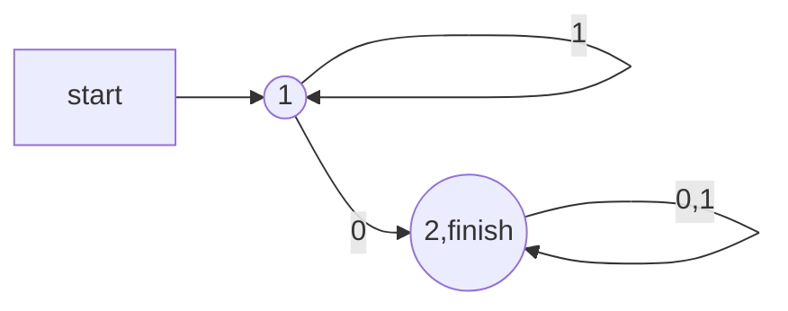
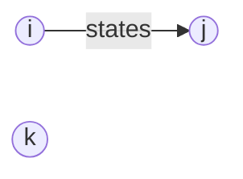
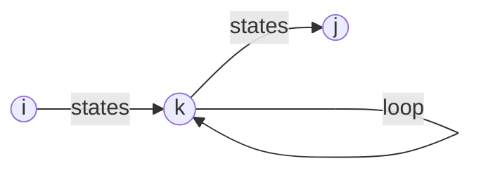
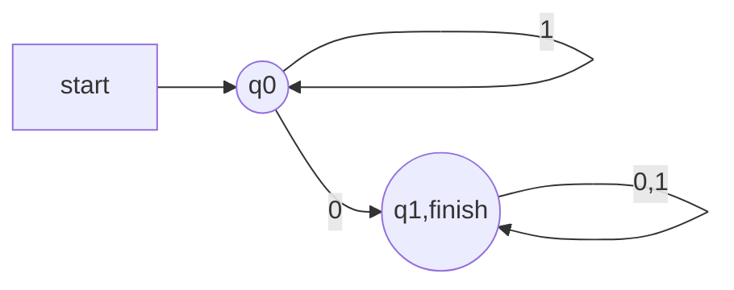

# 5.7更新
其实很早之前就已经写了，没来得及更新。。。
## 自动机实现
+ 更新了PDA（下推自动机）的实现，见`src/automata/PDA.py`
+ 更新了CFG（上下文无关文法的实现）和LL1解析器，见`src/automata/CFG.py`
+ 修补和优化了一些DFA,NFA实现的bug，为`NFA`正则添加了正则语法`[] . * +`，见`automata/NFA.py`
+ 为了实现上述两个自动机，新实现了数据结构“多键字典”，可见`container/multi_key_dict.py`。
## 词法解析器
+ 实现了一个基于DFA的简单词法解析器，见`lexer/lexer.py`。
+ 在`lexer/cmm_define.py`中定义了一系列词法规则，可以按需进行修改。
+ 直接运行`lexer/lexer.py`可对`example.cmm`中的文件进行词法解析。

## 未来计划
+ 基于已经实现的自动机实现语法分析器。
+ 优化、重构已实现的代码。
+ 补全README中对PDA、CFG、Lexer等的介绍。


最近可能没时间。。。先鸽为敬。
# 各类自动机模拟实现
项目地址： <a href="url">https://github.com/HuiyuanYan/automaton_simulation</a>
## 一、概述
本项目基于《编译原理》第二版和《自动机理论、语言和计算导论》第三版，以及网络资料，实现包括DFA、NFA在内的多种自动机，使用python语言进行编程，以期加深对自动机的理解。
## 二、项目结构
```
├─picture # 存放生成的DFA/NFA图片
├─src #存放源代码
│  ├─automata #自动机实现代码
│  └─container #使用到的其他容器实现代码
└─test #测试文件
```
## 三、项目环境
+ Python 3.9.7
+ graphviz version 6.0.1

## 四、项目运行
进入`test`文件夹执行`test_all.py`可运行全部测试样例。

## 五、实现原理
### 1.DFA
#### 1.1 DFA的基本实现
$\text{DFA(Deterministic Finite Automaton)}$的形式化定义如下：

一个确定型有穷自动机包括：
1. 一个有穷的状态集合，通常记作$Q$。
2. 一个有穷的输入符号集合，通常记作$\Sigma$。
3. 一个转移函数，以一个状态和一个输入符号作为变量，返回一个状态。转移函数通常记作$\delta$。
4. 一个初始状态，是$Q$中状态之一。
5. 一个终结状态或接受状态的集合$F$。集合$F$是$Q$的子集合。

通常用五元组来讨论和表示$DFA$:
$$
A=(Q,\Sigma,\delta,q_0,F)。
$$

在`src\automata\DFA.py`中，定义了`DFA`类，定义了它的各个组成：
```python
self.__Q = [] # states
self.__alphabet = []
self.__deltas = {}
self.__q0 = '' # start state
self.__finish_states = [] # finish state
```

可以通过接口函数`add_state/add_states, set_alphabet, set_deltas/add_delta, set_q0, set_finish_states`对它们分别进行设置。

#### 1.2 DFA运行

DFA是通过接受状态来接受语言的，即定义$\text{DFA A}$的语言。这个语言记作$L(A)$，定义为：
$$
L(A) = \{w|\hat{\delta}(q_0,w) \in F\}
$$
也就是说，语言$A$是让初始状态$q_0$通向接受状态之一的串$w$的集合。如果对某个$\text{DFA A}$来说$L$是$L(A)$，那么就说$L$是**正则语言**。

$\text{DFA}$模拟的算法为：

``` c
s = s0;
c = nextChar();
while(c! = eof){
    s = move(s,c);
    c = nxtChar();
}
if (s in F) return true;
else return false;
```

算法实现见函数`DFA.run(str)`。可以通过设置参数`verbose = True`来打印每一步的过程。

+ Example:
```python
d = DFA()
d.add_states(['q0','q1','q2','q3'])
d.set_alphabet({'0','1'})
d.set_q0('q0')
d.set_finish_states({'q3'})
d.set_deltas({'q0':[('0','q1')],
              'q1':[('1','q2')],
              'q2':[('0','q3')],
})
assert d.run('010') == True
```

#### 1.3 DFA最小化

[DFA最小化](https://www.geeksforgeeks.org/minimization-of-dfa/)对于每个DFA，求出在接受相同语言的任意DFA中具有最少状态数的等价DFA，且该最小DFA是**唯一的**。

算法的大致思路为：
```
1. 排除所有不能从初始状态到达的状态
2. 把剩下的状态划分为块，同一块中的状态都是等价的，并且不同块中的两个状态一定不等价。
```


排除不可达状态，可以使用**深度优先遍历**，从初始状态开始，找到所有可达节点，并删除不可达节点及其转移（transition）。

等价块划分采取“填表算法”（见《自动机理论、语言和计算导论》第二版P107），具体步骤为：
```
1. 新建一张"n*n"的表，其中n为消除不可达状态后的状态数。实际上，由于对称性，只需要使用对角线下半部分的表即可。

2.将所有状态按顺序编号0，1，2...，并对应于表的下标。

3.标记结束状态与其他状态不等价（即可区分，填对应表项为1）。

4.对表进行迭代操作，每次迭代遍历每个表项t[i][j](i<j)，若存在一个字母表中的字符c，可以将状态i，j区分，即状态i和状态j在c上转移的下一个状态被标记为不等价，那么标记t[i][j]可区分。

5.进行4中的迭代操作，直至表再无更新。

6.将表中未被标记的状态分别合并为一个状态（这里用到了并查集），重新设置状态，并根据原来的转移函数设置新转移函数。
```

代码见`src\automata\DFA.py`中`DFA.minimize()`函数。

#### 1.4 从DFA到正则表达式

通过归纳构造的方式从$\text{DFA}$构造正则表达式。

将DFA A中的每个状态编号（0，1，2，...，n）用$R_{ij}^{k}$作为正则表达式的名字，属于该正则的串$w$满足：$w$是从$A$中从状态$i$到状态$j$的路径的标记，且这条路径没有经过编号大于$k$的中间节点。



例如，对于上面的DFA，$R_{12}^{(0)}=0$，即$0$这个串满足能够从状态1到状态2，且中间没有编号大于0的节点（**中间**不经过任何节点）。

那么最终我们需要求的DFA的正则表达式则为$R_{start\_state,all\_end\_states}^{(n)}$，$n$为状态数，表示满足可以从开始状态到**所有**结束状态，中间可以经过任意节点的正则表达式。

下面为具体步骤：

归纳的基础为，当$k=0$时，由于所有状态的编号都大于等于1，所以这时对路径的限制为：**路径根本没有中间状态**。只有两种路径满足这样的条件：

1. 从状态$i$到$j$的一条弧。
2. 只包含某个顶点$i$的长度为0的路径。

当$i\not=j$时，只有情形1是可能的。检查该DFA，找到所有满足的输入符号$a_i$，使得在$a_i$上存在从$i$到$j$的转移。

+ 如果不存在这样的符号，$R_{ij}^{(0)}=\empty$。

+ 如果恰好有一个这样的符号$a$，则$R_{ij}^{(0)}=a$。

+ 如果同时有多个符号$a_1,a_2,...,a_n$满足，则$R_{ij}^{(0)}=a_1+a_2+...+a_n$。

当$i=j$时，合法路径为长度为0的路径（不进行转移）和从$i$到其自身的环。长度为0的路径正则表达式记为$\epsilon$，环的正则表达式则根据上述规则确定。最终$R_{ii}^{(0)}=\epsilon+a_1+a_2+...+a_n$。

当$k>0$时，从$i$到$j$的路径不经过比$k$高的状态，考虑如下两种情形：

1. 该路径不经过状态$k$，此时$R_{ij}^{(k)}=R_{ij}^{(k-1)}$。


2. 该路径至少经过状态$k$一次。此时可以把路径分为三段：$R_{ik}^{(k-1)}$、$(R_{kk}^{(k-1)})^*(\text{表示在k处自身转移了0到多次})$、$R_{kj}^{(k-1)}$。


故而有$R_{ij}^{(k-1)}=R_{ij}^{(k-1)}+R_{ik}^{(k-1)}(R_{kk}^{(k-1)})^*R_{kj}^{(k-1)}$。

最终对于所有$i$和$j$，都可以得到$R_{ij}^{(n)}$。假设状态1为初始状态，接受状态集合为${\{j_0,j_1,...j_n\}}$，所有表达式之和$\sum R_{1j_i}^{(n)}$即为自动机的语言。

详细代码见`src\automata\DFA.py\DFA.to_regex(re)`。

例子：
``` python
d = DFA_SRC.DFA()
d.set_alphabet({'0','1'})
d.add_states(['q0','q1'])
d.set_q0('q0')
d.set_finish_states({'q1'})
d.set_deltas(
    {
        'q0':[('0','q1'),('1','q0')],
        'q1':[('0','q1'),('1','q1')]
    }
)
print(d.to_regex())
```

对于该DFA：

输出的结果为
$$
0+(ε+1)(ε+1)^*0+(0+(ε+1)(ε+1)^*0)(ε+0+1)^*(ε+0+1)
$$

化简后为$10(0+1)^*$。

本功能并未实现对得到正则表达式的化简，需要自己手动进行化简。

### 2.NFA
#### 2.1 NFA的基本实现

$\text{NFA(NonDeterministic Finite Automata)}$的形式化定义如下：

一个$\text{NFA A}$可形式化表述为：

$$
A=(Q,\Sigma,\delta,q_0,F)
$$

其中：
1. $Q$是一个有穷的状态集合。
2. $\Sigma$是一个有穷的输入符号集合。
3. $q_0$是初始状态，属于$Q$。
4. $F$是终结（或接受）状态的集合，是Q的子集合。
5. 转移函数$\delta$是一个以$Q$中状态和$\Sigma$中的一个输入符号作为变量，并返回$Q$的一个**子集合**的函数。

同样地，在`NFA.py`中也保留了与`DFA.py`中类似的成员和接口函数。

需要注意的是，`NFA.set_deltas`中的参数类型与`DFA`中有所不同。

#### 2.2 NFA运行

NFA的模拟算法为：

```c
S = ε-closure(s0);
c = nextChar();
while (!c = eof){
    S = ε-closure(move(S,c));
    c = nextChar();
}
if(S ∩ F != Empty) return true;
else return false;
```

算法实现见函数`NFA.run(str)`。可以通过设置参数`verbose = True`来打印每一步的过程

#### 2.3 从NFA到DFA

从NFA到DFA的转换，使用**子集构造法**来实现。算法的描述为：

```python
Dstates = [];
Dtran = {};
Dstates.append([ε-closure(s0),unmarked]);
while there is an unmarked state T in Dstates:
    Mark T;
    for every ch in alphabet:
        U = ε-closure( move(T,ch) );
        if U not in Dstates:
            U.append([Dstates,unmarked]);
        Dtran[T,ch] = U;
```

然后根据`Dstates`和`Dtrans`重新设计DFA即可。

算法实现见函数`NFA.to_DFA()`。


#### 2.2 从正则表达式到NFA

本项目还实现了从基本正则表达式（包含的运算符号有 “ | ”（或）、“ * ”（闭包）、concat（连接））到NFA的转换。

采用的算法是[汤普森构造法](https://deniskyashif.com/2019/02/17/implementing-a-regular-expression-engine/)。

具体步骤为：

```
1. 将输入的正则表达式转换为后缀表达式，并添加相应的连接符。（见代码NFA.regex_to_NFA().infix_to_postfix(regex)）。

2. 根据获取的后缀表达式，利用汤普森构造法构造新NFA。（包含了对各个状态重新编号的过程）
```

实现见代码`NFA.regex_to_NFA()`。

### 3.自动机的图形表示

采用`pygraphviz`包利用`grpahviz`软件画图。

使用自动机下的`draw`方法进行调用画图。

默认存储路径为`picture`文件夹，可以在`config.py`中进行修改。

## 六、参考
> https://deniskyashif.com/2019/02/17/implementing-a-regular-expression-engine/
